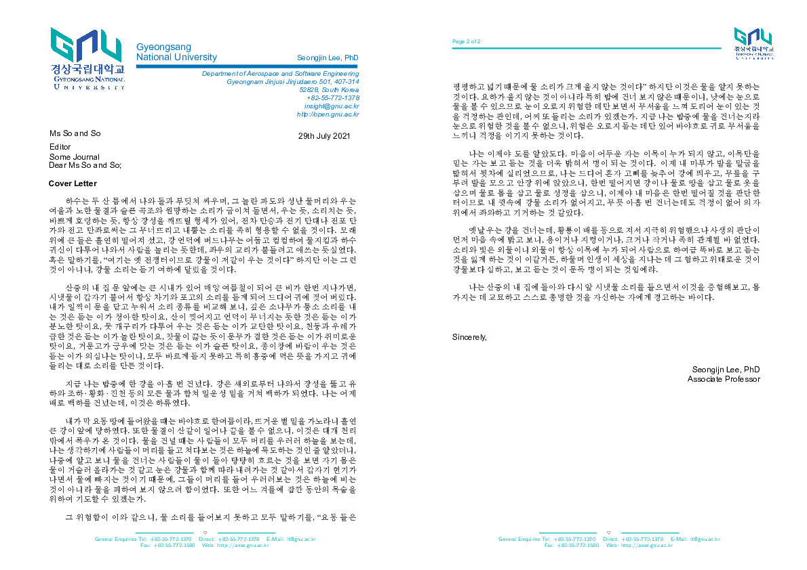
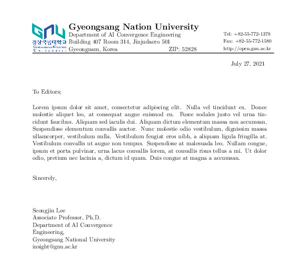
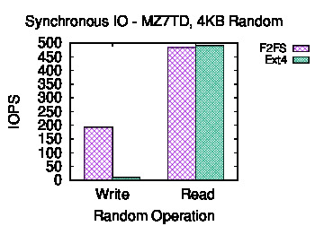
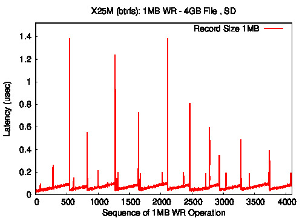
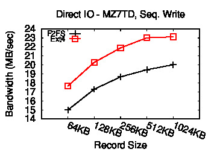
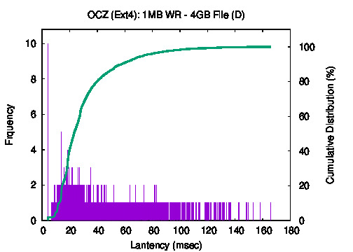
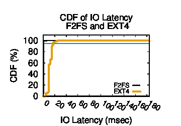

# Templates
Frequently used styles and templates

# TeX 
## GNU Letter Style A (gnu_letter_A)
* Logo on the left and address on the right of the header
* Dept contact on the footer



## GNU Letter Style B (gnu_letter_b)
* Logo on the left and address on the right of the header



# GnuPlot
Edit the variables in plot_this.GP file for title, data file, figure name, etc.

## Bar graph with comparison
To draw the figure run the following command
```
gnuplot plot_this.GP
```




## Single line graph
To draw the figure run the following command
```
gnuplot plot_this.GP
```




## Line graph with comparison
To draw the figure run the following command
```
gnuplot plot_this.GP
```




## CDF with Frequency (histogram) 
To draw the figure run the following command
```
gnuplot plot_this.GP
```




## Comparing two CDFs 
To draw the figure run the following command
```
sh ./example.sh
```
Be ware that time to draw the graph increases as the data file size increases. 



# Script

## KIRD skipper

[KIRD](https://cyber.kird.re.kr) 온라인 교육 스킵 스크립트 [How to use](./script/KIRD-skipper/README.md)


```javascript
// How to use: Run your browser's web debugger (F12) and copy-paste this on its JavaScript console.

if(pageTime == null) { console.log("Please run this script on the target 'HkmcMainFrame (clsrmContentsForm.do)'."); console.log("If you already done it, then unfortunately, this script is not working anymore..."); } else { pageTime = pageTime - 10000000; setBaseTimeCommit(); document.getElementsByClassName("btnNext")[0].onclick(); }

```